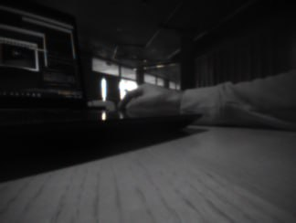
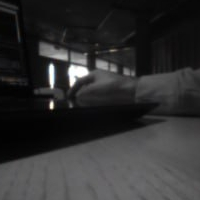

# Lab3 - IAA
Loic Brasey & Kylian Manzini

**What is the value of the FC frequency ?**
- 50MHz

**In the CfClient console do you only see your prints ? If not, explain the other prints.**
- No, there is many others from the base application, mainly use to provide feedback about the execution.

**What part of the data flow is responsible for these ?** 
- Some of theme come from the STM and some come from the others tasks of the GAP8.

**What happens when you connect 2 clients to the GAP8 ? Is it an expected behavior ?**
- As far as we know, the cpx lib is meant to be sent between different MCUs/host. And it doesn't mention multiple host support in the documentation. The code we've implement does seems to handle simultanous multiple hosts.

**What is the max packet size ?**
- The maximum transmission unit is 1022 byte (this includes CPX Header and DATA).

**Explain your implementation of the communication protocol**
- We basicly reproduce the same implementation as showed in the exemple (aideck-gap8-examples/examples/other/wifi-img-streamer/wifi-img-streamer.c).
Except the fact that we only send raws images.

**Provide a plot of one original image and one of the cropped images.**

**Explain your cropping algorithm**
- Our cropping algorithm keep the 200x200 centered pixels and we cut out the borders.
- 62 < x <= 262
- 22 < y <= 222

**What is the shape of the original image ?**
- 324x244[px]

